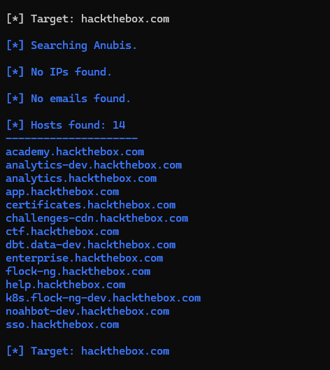

# glaive


## Introduction

glaive is a tool to streamline the useage of [theHarvestor ]( https://github.com/laramies/theHarvester) tool. It queries various sources and collects data such as email addresses,and subdomains, into one output file.

-->  Now allows saving condensed output to a file  <--


## Usage

1. Clone the repository:

```bash
git clone https://github.com/Destroyer7s/glaive.git
```


2. Install the dependencies:
```bash
pip install -r requirements.txt
```


3. Run glaive:

```bash
python3 glaive.py
```

4. Enter the domain when prompted.

5. Wait for theHarvester to gather information from different sources.

6. Check the output file for the results


# Sources

The following sources are used by theHarvester to collect data:

- anubis
- baidu
- bevigil
- binaryedge
- bing
- bingapi
- bufferoverun
- brave
- censys
- certspotter
- criminalip
- crtsh
- dnsdumpster
- duckduckgo
- fullhunt
- github-code
- hackertarget
- hunter
- hunterhow
- intelx
- otx
- pentesttools
- projectdiscovery
- rapiddns
- rocketreach
- securityTrails
- sitedossier
- subdomainfinderc99
- threatminer
- urlscan
- virustotal
- yahoo
- zoomeye

## Output

glaive uses theHarvestor tool to collect data and stores it in the HarvesterLog.txt file. Each source's results are listed separately.




## Disclaimer

Please use theHarvester responsibly and respect the privacy and security of others. Usage of this tool for malicious purposes is strictly prohibited.
